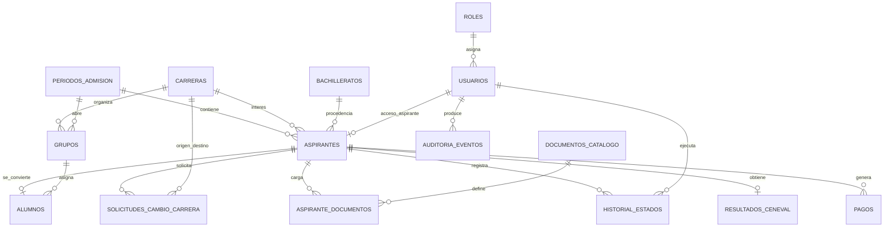

# Modelo entidad-relacion

Este modelo nace del prototipo funcional de aspirantes UTeM. La idea es separar lo que hoy vive como objetos JavaScript en tablas relacionales claras.

## Lectura general

Un `aspirante` pertenece a un `periodo_admision`, selecciona una `carrera`, viene de un `bachillerato` y avanza por estados. Durante el proceso tiene pagos, resultado CENEVAL, documentos, posibles solicitudes de cambio de carrera y, si cumple requisitos, se convierte en `alumno`.

Los usuarios institucionales se controlan con `usuarios` y `roles`. El aspirante tambien puede tener usuario para entrar al portal.

## Diagrama Mermaid

## Entidades y proposito

| Entidad | Proposito |
| --- | --- |
| `periodos_admision` | Controla convocatoria, ciclo y fechas generales. |
| `roles` | Define permisos principales: aspirante, admisiones, inscripciones, director academico y director de carrera. |
| `usuarios` | Guarda cuentas de acceso. En produccion guarda hashes, no contrasenas planas. |
| `carreras` | Catalogo de carreras ofertadas. |
| `bachilleratos` | Catalogo de escuelas de procedencia. |
| `aspirantes` | Datos personales, carrera deseada, promedio, estado y folio. |
| `pagos` | Pagos CENEVAL e inscripcion. |
| `resultados_ceneval` | Puntaje CENEVAL capturado por admisiones. |
| `documentos_catalogo` | Documentos obligatorios del proceso, incluyendo documentos PDF e imagenes como la foto del aspirante. |
| `aspirante_documentos` | Archivo, estatus, observaciones, fechas limite y prorrogas por aspirante. |
| `solicitudes_cambio_carrera` | Peticiones que revisa Direccion Academica. |
| `grupos` | Grupos simulados o reales por carrera y periodo. |
| `alumnos` | Alta oficial del aspirante como alumno. |
| `historial_estados` | Trazabilidad de cambios de estado. |
| `estado_transiciones` | Matriz formal de estados del prototipo. |
| `auditoria_eventos` | Registro general de acciones importantes. |

## Punto importante sobre certificados

El certificado de bachillerato no debe tratarse igual que un documento ordinario sin contexto. Por eso `aspirante_documentos` incluye:

- `fecha_limite`;
- `prorroga_hasta`;
- `motivo_prorroga`;
- `observacion`;
- `validado_por`;
- `validado_en`.

Asi el area de inscripciones puede aceptar una prorroga cuando la preparatoria no entrega el certificado antes de la fecha oficial.
